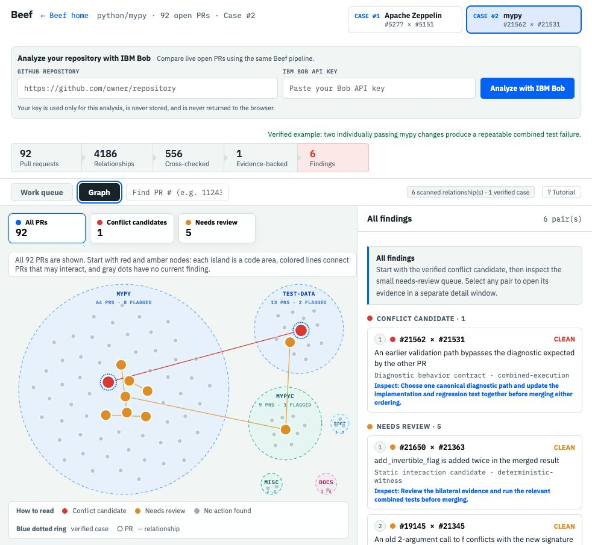
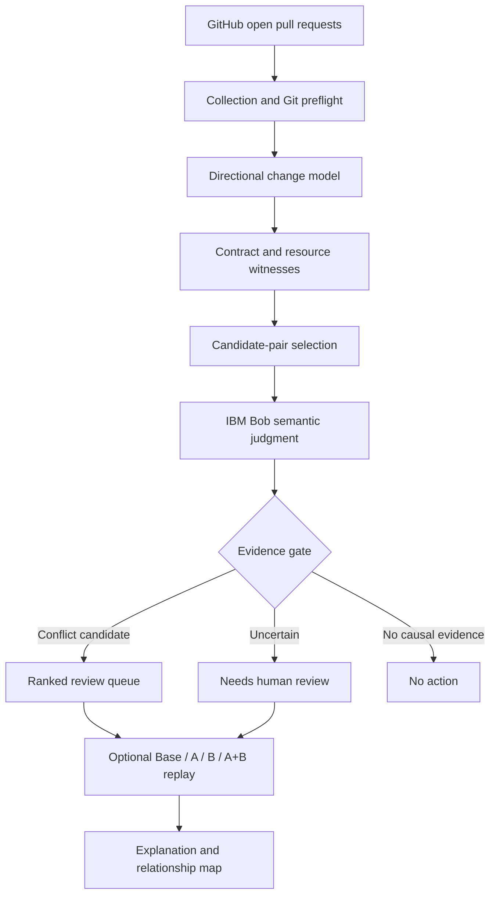
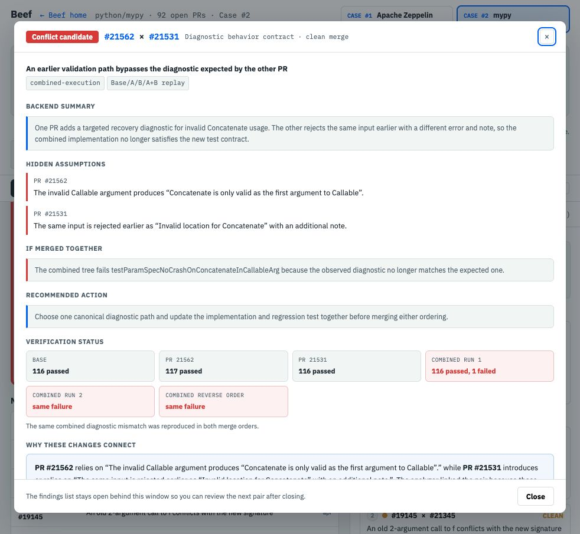

# Beef

### Cross-PR conflict analysis for AI-era software teams

Beef finds risks that appear **between pull requests**, not only between one pull request and the main branch.

Two pull requests can each pass review, CI, and Git merge checks while still carrying assumptions that become incompatible when the changes are combined. Beef reduces thousands of possible PR pairs to a bounded review queue, uses IBM Bob to reason about the surviving pairs, and explains the interaction with code-backed evidence.

[Live demo](https://ibmhackathon.vercel.app/) · [Open the verified cases](https://ibmhackathon.vercel.app/demo.html)



## Selected Challenge Theme

**Wildcard Challenge — Build Intelligent Systems for the Future of Work**

AI coding agents are increasing the amount of code that teams can produce, but review capacity has not increased at the same rate. Beef turns AI from a code generator into a review collaborator: it helps engineers decide which pending changes require attention before those changes converge on the main branch.

## Problem Statement

Most development safeguards evaluate one axis:

```text
Pull request ↔ main branch
```

CI asks whether one pull request passes its tests. Git asks whether its text can be merged. Review tools explain one diff at a time.

Parallel development creates a second axis:

```text
Pull request A ↔ pull request B
```

PR A may change a behavior, lifecycle, API, event, schema, or configuration that PR B assumes will remain stable. Neither PR must be individually incorrect. The regression can exist only in the combined state.

Checking every pair directly is impractical. A repository with `n` open pull requests has `n(n−1)/2` possible pairs. A useful system must therefore solve two different problems:

1. Find the small number of pairs that may interact.
2. Explain whether their assumptions are actually incompatible.

## Solution Description

Beef adds a cross-PR review layer on top of existing CI and Git checks.

It:

1. Collects open pull requests and their code changes.
2. Removes non-comparable, stacked, and mechanically conflicting cases.
3. Extracts directional evidence such as changed declarations, removed resources, new references, API routes, events, schemas, flags, and lifecycle behavior.
4. Produces a bounded set of candidate pairs.
5. Uses IBM Bob to compare the intent and assumptions of each surviving pair.
6. Shows conflict candidates and uncertain cases in a ranked work queue and repository relationship map.
7. When a repository supports it, runs isolated **Base / PR A / PR B / PR A+B** verification.

Beef does not replace CI, compilers, static analysis, or human review. It connects those tools and adds the missing PR-to-PR decision layer.

## AI Approach and Architecture

The architecture deliberately separates deterministic evidence from AI judgment. Deterministic stages make the search reproducible and affordable; IBM Bob handles the semantic comparison that rules alone cannot settle.



### 1. Collection and Git preflight

Beef fetches open PR metadata and patches from GitHub. It normalizes every PR against the same target branch and uses merge-tree analysis to separate:

- stacked or ancestor PRs;
- PRs already conflicting with the current base;
- ordinary Git text conflicts; and
- cleanly mergeable pairs that require semantic analysis.

Mechanical conflicts are not presented as silent semantic findings.

### 2. Directional evidence extraction

The analyzer preserves whether code was added, removed, or replaced. It builds witnesses for interactions such as:

- a removed declaration and a new reference;
- a changed function signature and a newly added old-arity call;
- an event producer change and a new consumer;
- an API route change and a cross-language client call;
- competing replacements of the same behavior;
- a changed schema, feature flag, or lifecycle assumption.

Shared files and similar names create relevance, not automatic conflict verdicts.

### 3. Candidate-pair selection

Beef joins compatible witness roles and resource identities to reduce the quadratic pair space. Candidate selection is bounded so that cost remains predictable on repositories of different sizes. A small exploration sample of unflagged pairs is retained to measure retrieval false negatives.

### 4. IBM Bob semantic judgment

IBM Bob receives a standardized case rather than an unstructured repository dump. The case contains:

- the two PR summaries and patches;
- extracted contracts and directional witnesses;
- Git preflight results;
- the suspected assumption on each side; and
- stable evidence identifiers.

Bob describes the merged interaction first, compares the two assumptions, and then returns a structured verdict. Beef accepts an AI conflict candidate only when the response points back to evidence from **both** PRs. Missing, one-sided, or unstable evidence becomes `needs review` rather than a confident conflict.

### 5. Executable replay

For supported repositories, the verifier runs:

```text
Base  → must pass
PR A  → must pass
PR B  → must pass
PR A+B → must repeatedly fail with the same signature
```

Only that pattern is executable evidence of a pair-induced regression. Baseline failures, single-PR failures, installation errors, and timeouts are recorded separately as inconclusive execution results.

## How IBM Bob Was Used

IBM Bob was used as both a development collaborator and a core runtime component.

### During development

The team used IBM Bob to:

- inspect real PR pairs and challenge early heuristic verdicts;
- compare independently developed detector approaches;
- review false positives and missed retrieval cases;
- refine the evidence contract between deterministic analysis and AI judgment;
- test whether the same case remained understandable when the underlying model changed; and
- review implementation changes before they entered the integrated pipeline.

This feedback was converted into automated regression tests and frozen benchmark cases instead of remaining as one-off prompt changes.

### Inside the product

In live analysis, IBM Bob is the semantic judge for the bounded candidate set. Beef controls the surrounding workflow:

- GitHub collection;
- pair generation and pruning;
- Git normalization;
- evidence extraction;
- structured prompt construction;
- bilateral evidence validation;
- uncertainty routing;
- optional combined execution; and
- visualization.

Bob therefore provides the reasoning capability, while Beef standardizes what Bob sees, validates what it returns, and turns the result into a repeatable engineering workflow.

The browser-provided Bob API key is used only for the active analysis request. It is not written to project files, stored by the application, or returned to the browser response.

## Verified Demonstration Cases

### Case #1 — Apache Zeppelin

PR [#5277](https://github.com/apache/zeppelin/pull/5277) and PR [#5151](https://github.com/apache/zeppelin/pull/5151) change opposite sides of the same restart contract.

- The Python MCP client treats a missing `noteId` as “restart globally.”
- The Java server change requires `noteId` on the original route and moves global restart behavior to another route.

The pair illustrates a cross-language producer/consumer contract disagreement that Git cannot identify from textual overlap alone.

### Case #2 — mypy

PR [#21562](https://github.com/python/mypy/pull/21562) and PR [#21531](https://github.com/python/mypy/pull/21531) independently pass their relevant checks but disagree about the diagnostic produced for the same invalid input.

In the captured replay:

- Base passed;
- PR A passed;
- PR B passed;
- A+B failed;
- the same failure was reproduced; and
- the failure remained when the merge order was reversed.



These cases are demonstrations of the workflow, not a claim that Beef can detect every class of semantic conflict in every language.

## What a Reviewer Sees

- A ranked queue containing only conflict candidates and bounded review cases.
- A repository map that groups PRs by the code area they affect.
- The hidden assumption carried by each PR.
- The change that violates the other PR's assumption.
- The likely combined impact.
- The exact code evidence used by the analyzer.
- A recommended next action.
- Execution evidence when Base/A/B/A+B replay is available.

## Technical Execution and Trust Controls

- Deterministic findings cannot be erased by an AI response.
- AI output must reference evidence from both PRs.
- Uncertainty is an explicit result, not silently converted into conflict.
- Git text conflicts and stacked PRs are separated from semantic findings.
- Base and single-PR failures are excluded from pair-induced regression claims.
- Repeated AI judgments must agree before they are marked stable.
- Frozen benchmark inputs cannot be modified by the improvement agent.
- API keys are server-side request inputs and are not committed or persisted.
- Docker verification does not receive host credentials or the Docker socket.

## Run Locally

Requirements:

- Node.js 20 or later
- Git
- A GitHub token for higher API limits
- IBM Bob credentials for live semantic judgment
- Docker only when executable replay is requested

```bash
git clone https://github.com/Comingtoyouliv2/ibmhackathon.git
cd ibmhackathon/assumption-radar
npm install
npm start
```

Open [http://127.0.0.1:4317](http://127.0.0.1:4317).

The two verified demo cases work without credentials. In the demo selector, choose **Connect your repository with your own IBM Bob API key** to analyze another public repository.

### CLI examples

```bash
# Deterministic scan
GITHUB_TOKEN=... npm run scan -- owner/repository

# IBM Bob semantic judgment
GITHUB_TOKEN=... BOBSHELL_API_KEY=... \
  npm run scan -- owner/repository \
  --ai --ai-provider bob --ai-repeats 1

# Verify the top three candidates with Base/A/B/A+B replay
GITHUB_TOKEN=... BOBSHELL_API_KEY=... \
  npm run scan -- owner/repository \
  --preflight --ai --ai-provider bob \
  --verify --verify-limit 3
```

## Deployment

The static application and API routes are configured for Vercel:

```bash
cd assumption-radar
npm install
npx vercel
```

At minimum, configure `GITHUB_TOKEN` in the deployment environment.

IBM Bob Shell is not bundled in the Vercel runtime. Live Bob analysis uses an access-controlled runner where Bob Shell is installed:

```text
Browser
  → Vercel /api/analyze
  → authenticated HTTPS Bob runner
  → IBM Bob
```

Set these server-side variables:

```bash
BOB_RUNNER_URL=https://your-private-runner.example/api/bob-judge
BOB_RUNNER_TOKEN=replace-with-a-long-random-secret
GITHUB_TOKEN=github_pat_...
```

The verified cases remain available even when a live Bob runner is not configured.

## Validation

```bash
cd assumption-radar
npm run check
npm test
npm run vercel-build
```

Current local validation:

- 130 automated tests passing;
- syntax checks for the analyzer, API, AI adapters, verifier, evaluator, and frontend;
- frozen semantic benchmark coverage for clean positives and hard negatives; and
- separate evaluation of triage quality, blocker quality, evidence quality, abstention, and end-to-end pair retrieval.

Benchmark scores are used as regression indicators, not as proof of universal cross-language generalization.

## Repository Structure

| Path | Purpose |
|---|---|
| `assumption-radar/src/` | GitHub collection, deterministic analyzer, AI adapters, preflight, CLI, and verification |
| `assumption-radar/public/` | Landing page, live demo, relationship map, and evidence UI |
| `assumption-radar/api/` | Vercel API routes |
| `assumption-radar/test/` | Automated regression tests and fixtures |
| `assumption-radar/eval/` | Pair-judgment and end-to-end radar evaluation |
| `assumption-radar/benchmarks/` | Frozen, adjudicated, live, and historical evaluation assets |
| `assumption-radar/docs/` | Framework, evaluation rubric, and integration documentation |

## Feasibility and Real-World Impact

Beef is designed to fit beside existing review systems rather than replace them. Teams can begin with candidate ranking and evidence-backed explanations, then enable executable replay only for repositories with known build profiles.

The immediate value is reviewer time: instead of manually reasoning about every possible pair, maintainers receive a small, ordered list of changes that may interact and an explanation of why. As AI coding increases parallel change volume, this cross-PR decision layer becomes a practical way to preserve review quality without requiring review teams to grow at the same rate.
