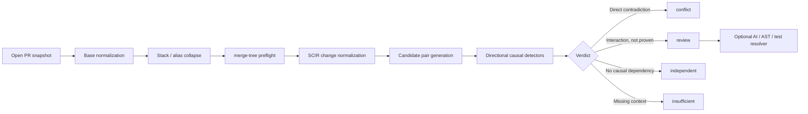

# Assumption Radar 미팅 브리프

- 현재 제품 버전: `v0.9.0`
- 평가 suite: `v0.1`
- 기준일: 2026-07-16

## 1. 한 줄 목표

> Open PR들이 merge되기 전에, 여러 PR 중 서로의 숨은 전제와 계약이 부딪히는 쌍을 찾아 근거와 함께 설명한다.

이 제품이 풀어야 하는 문제는 두 단계다.

1. 여러 PR 중 어떤 쌍을 비교해야 하는지 찾는다.
2. 선택한 두 PR이 실제 semantic conflict인지 판정한다.

## 2. 문제 정의

Assumption Radar에서 pair-induced semantic conflict는 다음을 모두 만족한다.

1. PR A는 공통 base에서 단독으로 정상이다.
2. PR B도 공통 base에서 단독으로 정상이다.
3. A+B를 함께 적용하면 A 또는 B의 검증 가능한 기대·계약·행동이 깨진다.

다음은 semantic conflict로 보지 않는다.

- 같은 파일이나 같은 함수의 단순 동시 수정
- 한 PR만 적용해도 발생하는 single-PR bug
- 두 PR 이전부터 있던 pre-existing defect
- 의도된 기능 합집합
- stack/ancestor 관계
- Git이 이미 잡는 텍스트 충돌 자체
- 근거 없이 위험해 보이는 미래 가능성

## 3. 개발 방식

저장소마다 같은 위험 점수를 적용하지 않고, 구체적인 causal witness를 찾는 방식으로 설계했다.



### 3.1 Base와 Git 관계 정리

- 각 PR을 동일한 최신 target base 기준으로 정규화한다.
- `git merge-tree`로 텍스트 충돌을 semantic conflict와 분리한다.
- ancestor/stack PR을 접어 같은 충돌의 중복 경고를 막는다.
- 한 PR 자체가 현재 base와 충돌하면 여러 pair conflict로 증폭하지 않고 보류한다.

### 3.2 SCIR: 언어 중립 변경 표현

Patch를 방향성을 보존한 공통 표현으로 변환한다.

- file add/remove/rename/modify
- declaration과 signature
- added/removed identifier와 reference
- import/binding lifecycle
- API, schema, event, config surface
- producer/consumer 관계

Java, Python, TypeScript adapter와 generic fallback을 제공한다. 저장소 특화 규칙은 core 점수를 바꾸지 않고 detector plugin으로 추가한다.

### 3.3 Causal detector

현재 직접 증명하는 대표 패턴:

- signature 변경 vs 기존 형식 callsite 추가
- rename/remove vs 이전 이름 신규 참조
- import/binding 제거 vs unqualified 신규 사용
- 동일 declaration의 중복 추가
- 제거된 event vs 신규 consumer
- 같은 기존 동작의 경쟁 교체

같은 파일·hunk·declaration은 관련성 신호로만 보존한다. dependency, composition-risk 또는 contradiction이 없으면 사용자 경고로 승격하지 않는다.

### 3.4 AI의 역할

- deterministic conflict는 AI가 지울 수 없다.
- AI는 `review` 사례의 호환성 판단에만 선택적으로 사용한다.
- 현재 고정 benchmark baseline은 AI 호출 없이 deterministic heuristic+SCIR만 실행했다.
- 따라서 현재 baseline은 재현 가능하며 토큰과 모델 비용이 0이다.

### 3.5 History/replay 기반 데이터 수집

실제 fixing commit에서 원인 line의 계보를 역추적한다.

```text
fixing PR
→ fixing hunk 이전 source line
→ time-bounded blame
→ 원인 PR lineage
→ ancestry independence gate
→ base/A/B/A+B/fixed counterfactual replay
```

이 과정을 통해 pre-existing defect, single-parent bug, stack duplicate를 semantic conflict positive에서 제외한다.

## 4. 평가 자산

### 4.1 Pair Judgment Test

질문:

> 충돌 후보 PR 두 개가 주어졌을 때 실제 conflict인지 판정하는가?

- 역사적 Java clean-merge pair 40건
- semantic conflict 20건
- hard negative 20건
- 33개 저장소
- 모든 pair는 기계적으로 clean merge

### 4.2 End-to-End Radar Test

질문:

> 여러 PR 중 실제 conflict pair를 직접 찾아 상위에 배치하는가?

- episode 2개
- episode당 PR 40개
- episode당 가능한 pair 780개
- 전체 pair 1,560개
- 실제 historical conflict 20쌍
- historical hard negative 20쌍
- 격리된 module control 1,520쌍
- 시스템은 episode마다 상위 20쌍만 제출

역사적 실제 변경을 익명화된 synthetic monorepo에 재배치한 controlled end-to-end 평가다.

## 5. 현재 결과

### 5.1 Pair Judgment

| 지표 | v0.9 결과 |
|---|---:|
| TP / FP / TN / FN | 17 / 1 / 19 / 3 |
| Triage precision | 94.4% |
| Triage recall | 85.0% |
| Triage F1 | 89.5% |
| Blocker precision | 100.0% |
| Blocker recall | 85.0% |
| False blocker rate | 0.0% |
| Harmless review rate | 5.0% |
| Work reduction | 55.0% |
| Decisive coverage | 97.5% |
| 전체 실행시간 | 약 6.2초 |
| AI 비용 | $0 |

해석:

- `conflict`라고 확정한 17건은 모두 실제 conflict였다.
- 실제 conflict 20건 중 3건을 `independent`로 놓쳤다.
- 고정밀 blocker로는 강하지만 모든 semantic conflict를 포괄하지는 못한다.

주요 누락:

- enum → class 변화와 이전 사용 방식의 결합
- 서로 다른 위치의 type evolution
- class field 제거 vs 신규 method reference

### 5.2 End-to-End Radar

| 리뷰 예산 | Recall | Precision | Pair reduction |
|---:|---:|---:|---:|
| Top 5 | 10.0% | 20.0% | 99.4% |
| Top 10 | 50.0% | 50.0% | 98.7% |
| Top 20 | 80.0% | 40.0% | 97.4% |

- MAP@20: 35.7%
- 전체 실행시간: 약 7.8초
- AI 비용: $0
- Top 20 밖으로 놓친 conflict: 4건
- 각 episode top 20에 isolated-module control이 12건씩 포함됨

해석:

> Pair를 주면 잘 판정하지만, PR pool에서 가장 중요한 pair를 상위에 배치하는 retrieval/ranking은 아직 약하다.

Pair Judgment recall은 85%였지만 End-to-End Recall@5는 10%였다. 즉 현재 가장 큰 병목은 판정기 자체보다 후보 검색과 순위화다.

### 5.3 실제 OSS 채굴과 오염 방지

Python pandas history campaign:

- merged Python PR 245개
- fix anchor 163개
- 최초 file-overlap 후보 30개
- lineage/independence 후 4개
- diff-tree 검증 후 2개
- executable positive 0개
- executable hard negative 2개

Replay 자동 필터:

| 저장소 | raw 후보 | 독립 family | 자동 판정 | 수동 큐 |
|---|---:|---:|---:|---:|
| VS Code | 10 | 9 | 5 | 4 |
| Kubernetes | 3 | 1 | 1 | 0 |

자동 판정된 사례는 pre-existing defect 또는 single-parent bug였고 새 pair-induced positive는 0개였다. 이 결과는 recall 향상 수치가 아니라 잘못된 positive가 benchmark에 들어가는 것을 막은 성과다.

## 6. 현재 말할 수 있는 것

### 증명된 것

- Java clean-merge pair에서 직접적인 구조적 conflict를 높은 precision으로 탐지한다.
- signature, rename, import, duplicate, event lifecycle 같은 방향성 dependency를 설명 가능한 witness로 반환한다.
- stack, textual conflict, pre-existing defect, single-parent bug의 오귀속을 줄이는 필터가 있다.
- PR 40개·780쌍을 약 수 초 안에 전수 비교할 수 있다.
- pair 판단과 end-to-end 검색을 분리해 측정할 수 있다.

### 아직 증명되지 않은 것

- 자연적인 open-PR 분포에서의 production precision
- 처음 보는 저장소에 대한 hidden generalization
- Python·TypeScript 실제 positive에서의 recall
- cross-service와 깊은 behavioral conflict
- 설명 품질의 독립 사람 평가
- 자동 merge gate로 사용할 통계적 안전성

따라서 현재 포지션은 다음과 같다.

> 확실한 구조적 모순을 빠르고 안전하게 증명하는 deterministic 1차 Radar이며, 복잡한 문맥 추론과 후보 순위화는 다음 개선 대상이다.

## 7. 팀 공통 비교 방식

모든 팀은 동일한 두 평가를 수행한다.

1. Pair Judgment: 주어진 pair의 판정 능력
2. End-to-End Radar: PR pool에서 conflict pair 검색·판단·순위화 능력

최종 시스템 선택에서는 End-to-End Recall@5/10/20과 Precision@5/10/20을 우선한다. Pair Judgment 결과는 실패 원인을 판정 단계와 검색 단계로 나누는 진단 지표로 사용한다.

내부 개발 방식은 End-to-End 평가에서 자유다.

- deterministic analysis
- AST/graph
- heuristic
- LLM/agent
- hybrid pipeline

공통으로 고정하는 것은 입력, 사용 가능한 정보, 출력 스키마, 시간·비용 기록뿐이다.

## 8. 다음 개선 우선순위

1. Candidate retrieval/ranking
   - module/repository boundary를 candidate graph에 반영
   - isolated control을 top K에서 제거
   - causal witness와 proximity score를 분리해 순위화

2. 누락 conflict 보강
   - remove-vs-reference의 field lifecycle
   - enum/class와 qualified type evolution
   - cross-location behavioral composition

3. Hybrid resolver
   - deterministic filter가 잡지 못한 관련 pair만 AI/AST/targeted test에 전달
   - 비용을 전체 n²이 아니라 top candidate에만 사용

4. Prospective hidden test
   - 시스템 동결 후 새로운 repo snapshot 수집
   - 실제 open PR episode를 양 팀에 블라인드 제공
   - repo/family 단위로 gold adjudication

5. Multi-language positive
   - Python·TypeScript에서 실제 또는 executable injection positive 확보
   - language × archetype slice를 분리 평가

## 9. 미팅에서 사용할 90초 설명

> 우리는 semantic conflict를 저장소마다 같은 위험 점수를 적용하는 분류 문제로 보지 않고, 두 PR 사이의 구체적인 causal witness를 찾는 문제로 설계했습니다. 먼저 base와 stack 관계를 정리하고 merge-tree로 텍스트 충돌을 분리한 뒤, patch를 SCIR이라는 공통 변경 표현으로 바꿉니다. 그 위에서 signature 변경과 old callsite, rename과 old reference, import 제거와 신규 사용처럼 방향성이 있는 모순만 conflict로 확정합니다. 현재 Java clean-merge pair 40건에서는 precision 94.4%, recall 85%, false blocker 0이 나왔습니다. 다만 이 점수는 pair를 미리 준 결과입니다. PR 40개에서 780쌍을 직접 찾게 한 end-to-end 테스트에서는 Recall@5가 10%, Recall@20이 80%였습니다. 따라서 현재 강점은 고정밀 pair 판단이고, 가장 큰 병목은 후보 검색과 상위 순위화입니다. 이번 팀 비교도 두 평가를 분리해서, 누가 단순히 pair를 잘 판단하는지가 아니라 실제 PR pool에서 충돌쌍을 더 높은 순위로 찾는지를 중심으로 결정할 예정입니다.

## 10. 근거 파일

- Pair 결과: `benchmarks/comparisons/pair-qualification-v0.1/assumption-radar-v0.9.0/report.md`
- End-to-End 결과: `benchmarks/radar-arena-v0.1/baselines/assumption-radar-v0.9.0/report.md`
- v0.9 상태: `docs/STATUS-v0.9.0.md`
- 프레임워크: `docs/FRAMEWORK.md`
- 공통 평가 패키지: `handoff/semantic-conflict-evaluation-suite-v0.1.zip`
